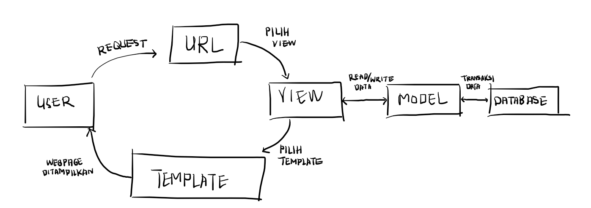
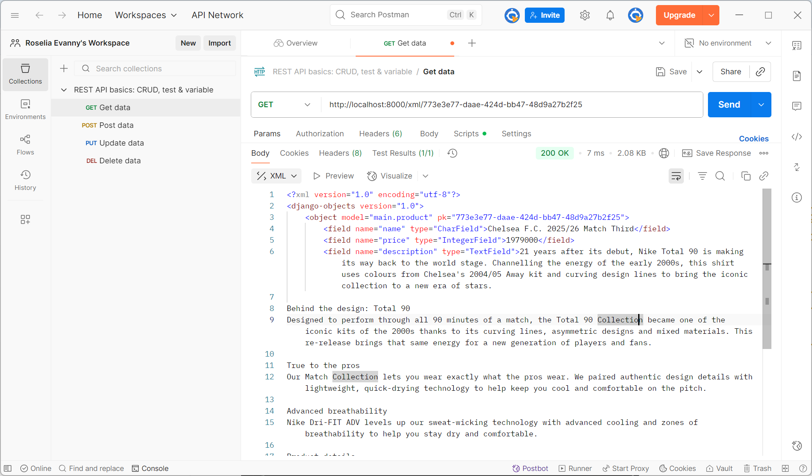
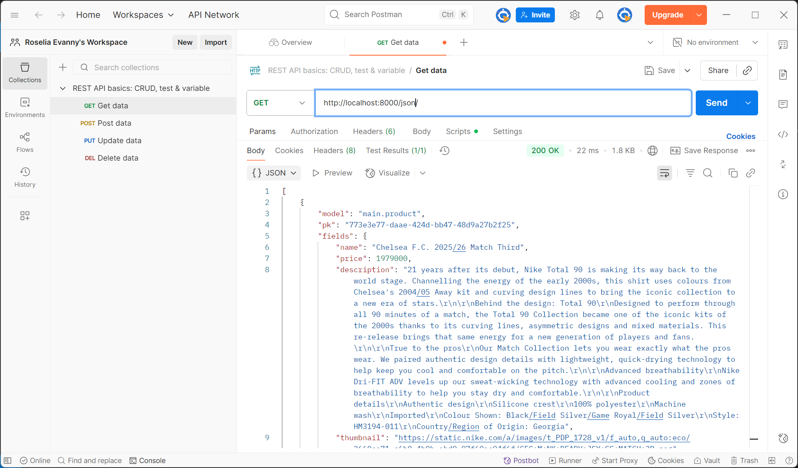
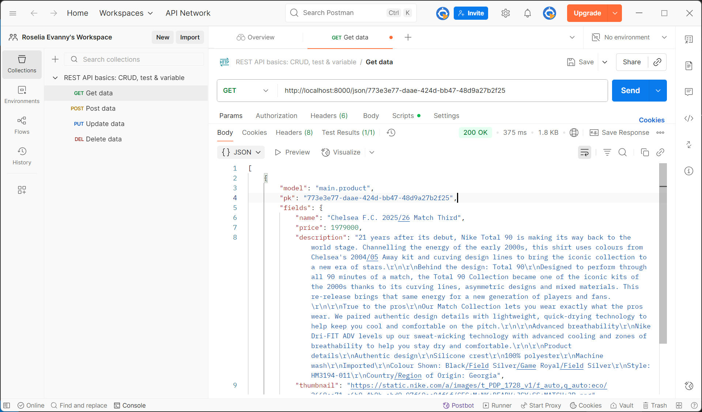

Link: https://roselia-evanny-footballshop.pbp.cs.ui.ac.id/

<b>Tugas 2</b>

Penjelasan mengenai implementasi checklist:
Pertama, saya membuat direktori baru sebagai letak proyek ini. Kemudian, saya melakukan instalasi terhadap dependencies dan membuat proyek Django. Kemudian, saya membuat environment variables untuk menyimpan kredensial database dan pengaturan environment. Kemudian saya menambahkan beberapa konfigurasi di settings.py, seperti menambahkan local host sebagai host yang dapat mengakses web di ALLOWED_HOSTS. Kemudian saya mengubah konfigurasi database, yaitu pada proses production, database yang digunakan adalah PostgreSQL, sedangkan pada proses development, database yang digunakan adalah SQLite. Selanjutnya, saya melakukan migrasi database dan menjalankan servernya. Ini berarti proyek Django berhasil dibuat.

Selanjutnya, saya menghubungkan direktori letak proyek ini ke github. Sebelum itu, saya membuat berkas .gitignore agar berkas yang tercantum di .gitignore, seperti kredensial database atau pengaturan environment, tidak di-push ke github. Selanjutnya, saya menghubungkan proyek ini ke PWS dan menambahkan URL deployment PWS ke ALLOWED_HOSTS di settings.py. Kemudian, saya melakukan add, commit, dan push ke github dan PWS.

Selanjutnya, saya membuat aplikasi main dan mendaftarkannya ke INSTALLED_APPS di settings.py. Selanjutnya, saya membuat berkas .html di aplikasi main, yang berisi informasi nama dan NPM saya. Kemudian, saya membuat model di main, yaitu model Product, saya menambahkan beberapa atribut wajib dan fungsi, lalu melakukan migrasi untuk mengubah struktur tabel basis data sesuai dengan model yang telah dibuat. Kemudian, saya menambahkan fungsi show_main di views.py pada main. Fungsi ini akan menampilkan data yang sesuai ke berkas .html yang sebelumnya telah dibuat.

Tahap selanjutnya adalah melakukan routing dengan membuat berkas urls.py di main. Fungsi show_main perlu di-import ke urls.py, agar fungsi dapat dipanggil ketika URL cocok dengan pola yang ditentukan. Kemudian, saya menambahkan urls.py yang berada di main ke urls.py yang berada di proyek. Sehingga, apabila ditemukan URL yang cocok, maka akan diteruskan ke urls.py di aplikasi. Kemudian saya melakukan add, commit, dan push, agar perubahan yang dilakukan bisa diperbarui.

Secara singkat, saya membuat proyek Django baru, mengubah konfigurasinya, lalu menghubungkannya ke github dan di-deploy di PWS terlebih dahulu. Setelah itu, saya baru membuat aplikasi main, berkas .html, views.py, membuat model, dan routing pada urls.py di main untuk memetakan fungsi yang telah dibuat di views.py.

Penjelasan mengenai bagan request client ke web aplikasi berbasis Django:
Referensi bagan: https://www.google.com/url?sa=i&url=https%3A%2F%2Fagus-hermanto.com%2Fblog%2Fdetail%2Fdjango-flask-framework-python-untuk-web-design-dan-web-development&psig=AOvVaw1GkcxNYxSd5Kl1g29ZGEra&ust=1757432943111000&source=images&cd=vfe&opi=89978449&ved=0CBUQjRxqFwoTCLDw84DCyY8DFQAAAAAdAAAAABAK

Ketika user melakukan request, request tersebut akan diterima server, lalu akan dibaca urls.py untuk menyocokkan URL yang diminta user ke fungsi yang sesuai di views.py. Jika dibutuhkan data, maka views.py akan memanggil models.py untuk membaca atau menulis data di database. Kemudian, view akan mengirim data ke berkas .html yang dirender menjadi halaman web dan akan ditampilkan ke user.

Penjelasan mengenai settings.py dalam proyek Django:
settings.py dalam proyek Django berfungsi untuk mengatur konfigurasi proyek. Sehingga, pengembang dapat mengatur hal-hal penting hanya dalam satu berkas. settings.py mengatur keamanan proyek, database yang digunakan,  mengatur aplikasi yang digunakan, serta dapat mengatur bahasa dan zona waktu yang digunakan. Dalam tugas ini, beberapa contoh penggunaan settings.py adalah ketika mengubah penggunaan database yang berbeda untuk proses production dan development. Selain itu, ketika membuat aplikasi main, main perlu dicantumkan di INSTALLED_APPS di settings.py. Pada settings.py, terdapat juga pengaturan DEBUG, dimana apabila DEBUG=TRUE, maka akan dimunculkan penjelasan errornya, ini berguna untuk proses development. Sedangkan pada DEBUG=FALSE, tidak akan dimunculkan penjelasan error, ini berguna untuk proses production. Dengan adanya settings.py, ini memudahkan pengembang untuk mengatur semua pengaturan penting.

Penjelasan mengenai cara kerja migrasi database di Django:
Migrasi database di Django adalah proses membuat dan mengubah struktur database berdasarkan definisi model yang berada di berkas models.py. Jadi, setelah membuat model di berkas models.py, perlu dijalankan instruksi python manage.py makemigrations. Instruksi ini akan mempersiapkan file migrasi yang merepresentasikan perubahan pada model. Kemudian, dijalankan instruksi python manage.py migrate. Instruksi ini akan menjalankan semua perubahan yang tercantum pada file migrasi yang sebelumnya telah dibuat, sehingga tabel database akan diperbarui. Sehingga, ini membuat pengelolaan database lebih mudah.
Referensi: 
UNMAHA. (2024). Migrasi Database Django: Langkah-langkah yang Benar untuk Pengembangan Tanpa Masalah. Diambil kembali dari UNMAHA: https://blog.unmaha.ac.id/migrasi-database-django-langkah-langkah-yang-benar-untuk-pengembangan-tanpa-masalah/

Penjelasan mengenai framework Django sebagai permulaan pembelajaran pengembangan perangkat lunak:
Menurut saya, framework Django dijadikan permulaan pembelajaran pengembangan perangkat lunak karena Django menggunakan bahasa pemrograman Python, yaitu salah satu bahasa yang populer di kalangan developer, terutama pemula. Selain itu, banyak fitur bawaan sehingga developer tidak perlu membuatnya sendiri, seperti sistem autentikasi,ORM (Object Relational Mapper) yang menghubungkan Python dengan database, dan berbagai macam lainnya. Sehingga, bisa lebih fokus untuk memahami konsep dasar web development. Selain itu, Django memiliki fleksibilitas tinggi karena dapat dijalankan di berbagai platform. Django juga memiliki keamanan yang baik, framework ini dilengkapi fitur untuk melindungi serangan siber seperti Cross-Site Scripting (XSS), Cross-Site Request Forgery (CSRF), dan SQL injection.
Referensi:
Kvartalnyi, N. (2025, Maret 30). 10 Advantages of Using Django for Web Development. Diambil kembali dari inoxoft: https://djangostars.com/blog/top-14-pros-using-django-web-development/
Ryabtsev, A. (2025, Januari 9). Top 14 Pros of Using Django for Python Web Development. Diambil kembali dari djangostars: https://inoxoft.com/blog/10-advantages-of-using-django-for-web-development/

Feedback untuk asisten dosen tutorial 1:
Saya merasa asisten dosen sangat membantu dalam pengerjaan tutorial, asisten dosen menjelaskan dengan jelas dan tanggap untuk membantu apabila terdapat masalah pada pengerjaannya.

<b>Tugas 3</b>

Penjelasan mengenai data delivery dalam pengimplementasian sebuah platform:
Data delivery diperlukan untuk mengirimkan data dari suatu sistem ke sistem yang lain agar aplikasi dapat bertukar informasi. Data delivery diperlukan karena biasanya frontend (user interface yang dilihat user) dan backend (server yang memproses data) terpisah. Dengan adanya data delivery, data yang diproses di backend dapat dikirimkan ke frontend agar bisa ditampilkan ke pengguna. Selain itu, apabila platform memiliki beberapa sistem terpisah seperti aplikasi mobile dan aplikasi web, maka data delivery juga dapat memastikan semua sistem memiliki data yang konsisten dan sinkron. 

Penjelasan mengenai XML dan JSON:
Menurut saya, JSON lebih baik daripada XML. JSON bersifat sederhana dan fleksibel, sedangkan XML bersifat kompleks dan kurang fleksibel. XML menggunakan struktur sintaks yang menggunakan tag pembuka dan penutup seperti HTML, sedangkan JSON menggunakan sintaks seperti dictionary di Python, yaitu pasangan key dan value. Sehingga, XML cenderung lebih panjang dan sulit dibaca, sedangkan JSON lebih mudah dibaca dan lebih ringkas. JSON juga merepresentasikan data yang sama dalam ukuran file yang lebih kecil dan transmisi data yang lebih cepat. JSON lebih populer dibandingkan XML karena JSON berasal dari sintaks JavaScript, yang menjadi bahasa utama di browser. JSON juga lebih sering digunakan untuk sistem baru, sedangkan XML lebih sering digunakan untuk sistem lama.
Sumber:
Amazon Web Services. (n.d). Apa Perbedaan antara JSON dan XML?. Diambil kembali dari AWS: https://aws.amazon.com/id/compare/the-difference-between-json-xml/

Penjelasan mengenai method is_valid() pada form Django:
Method is_valid() pada Django dibutuhkan untuk memvalidasi data yang diberikan oleh pengguna melalui form, sebelum data tersebut disimpan atau diproses ke database. Method ini akan mengecek apakah input yang diberikan pengguna sudah sesuai dengan tipe field yang didefinisikan di form. Jika sudah sesuai, maka data akan diproses dan disimpan ke database. Jika tidak sesuai, Django akan memberikan pesan error dan data tidak akan disimpan di database. Method ini dibutuhkan untuk mencegah data yang tidak valid masuk ke database.

Penjelasan mengenai csrf_token saat membuat form di Django:
CSRF adalah serangan yang mengelabui pengguna untuk menjalankan tindakan yang tidak diinginkan pada aplikasi web dengan mengirimkan script kepada pengguna yang akan secara langsung dieksekusi apabila diklik. Serangan ini memalsukan pengiriman request ke situs web agar terlihat seperti pengguna asli. csrf_token digunakan untuk mencegah serangan CSRF, dan csrf_token adalah kode unik yang akan diberikan untuk setiap form, lalu token ini akan dikirim bersama form dan diverifikasi saat form disubmit. Jika token tidak cocok, maka Django akan menolak request. csrf_token dibutuhkan agar kita bisa memverifikasi bahwa request benar-benar berasal dari pengguna dan form asli dari aplikasi yang akan diproses. Jika kita tidak menambahkan csrf_token pada form, maka penyerang dapat membuat form palsu yang mengirim request ke aplikasi, sehingga server tidak dapat membedakan request asli dan request palsu. Jika kita tidak menambahkan line  pada form, maka Django akan mengirimkan pesan error. Dengan csrf_token, kita bisa melindungi pengguna dan data dari serangan berbahaya.
Sumber:
codingstudio. (2023, 19 November). CSRF (Cross Site Request Forgery): Pengertian, Jenis dan Cara Mencegahnya. Diambil kembali dari codingstudio: https://codingstudio.id/blog/csrf-adalah/ 
chippiko. (2023, 8 Januari). Apa itu CSRF (Cross-Site Request Forgery)?. Diambil kembali dari chippiko: https://www.chippiko.com/apa-itu-csrf

Penjelasan mengenai implementasi checklist:
Pertama, saya membuat fungsi baru di views.py pada main yang akan menampilkan semua data dalam bentuk XML atau JSON, dan menampilkan data yang sesuai dengan ID dalam bentuk XML atau JSON. Kemudian, saya membuat routing dengan menambahkan fungsi tersebut di urls.py bagian main, sehingga fungsi tersebut dapat diakses melalui browser atau Postman.

Selanjutnya, saya membuat forms.py di main untuk membuat form yang menerima data. Kemudian, saya menambahkan fungsi di views.py untuk menambahkan produk di forms dan menampilkan produk yang tersedia. Selanjutnya, saya menambahkan fungsi tersebut ke urls.py dan menambahkan path URLnya ke urlpatterns. Selanjutnya, saya mengubah template.html yang ada di main, dan menambahkan tombol untuk menambahkan produk serta redirect ke halaman form serta kode untuk menampilkan produk yang ada dan melakukan redirect ke halaman detail produk.

Kemudian, saya membuat halaman yang akan menampilkan  formsnya di create_product.html dan halaman untuk menampilkan detail produk di product_detail.html. Pada forms tersebut, saya juga menambahkan  untuk mencegah serangan CSRF. Setelah itu, saya juga mengubah settings.py dan menambahkan CSRF_TRUSTEG_ORIGINS. Terakhir, saya melakukan add, commit, dan push ke GitHub dan PWS.

Feedback untuk asisten dosen di tutorial 2:
Penjelasan yang diberikan sangat membantu dan jelas, serta asisten dosen membantu saya ketika terdapat permasalahan dalam pengerjaan tutorial. Asisten dosen juga memberikan feedback yang jelas jika terdapat kesalahan dalam pengerjaan.

Screenshot dari hasil akses URL pada Postman:

