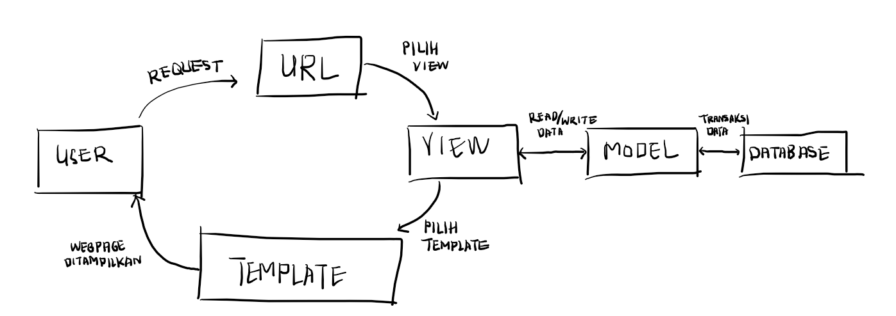
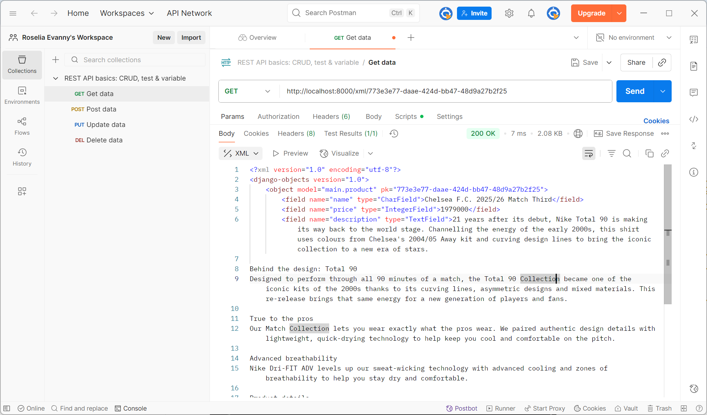
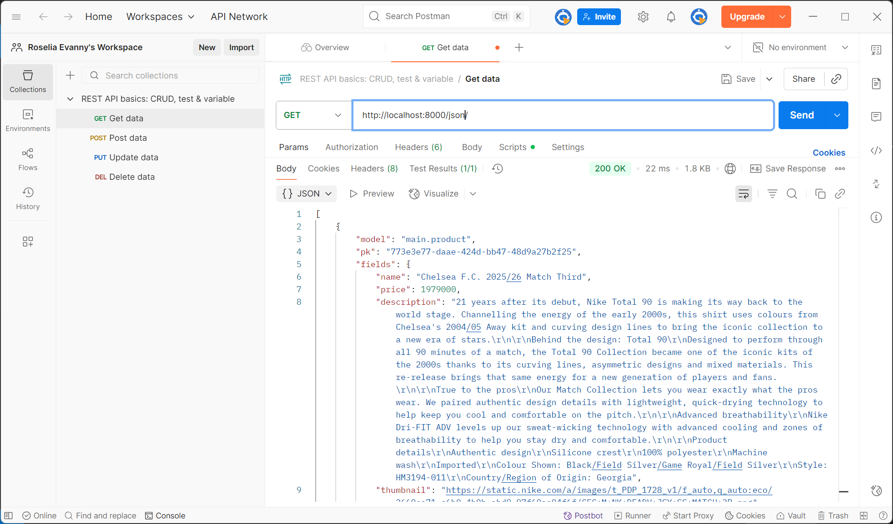
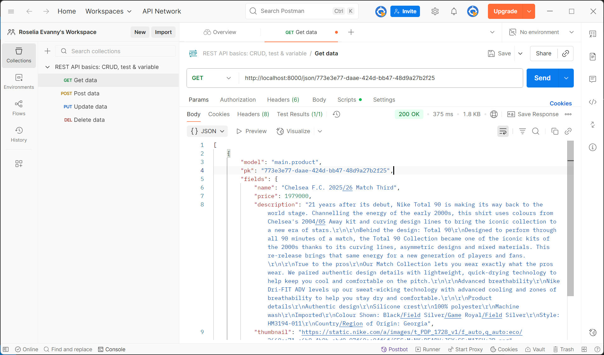

Link: https://roselia-evanny-footballshop.pbp.cs.ui.ac.id/

<b>Tugas 2</b>

## Penjelasan mengenai implementasi checklist
Pertama, saya membuat direktori baru sebagai letak proyek ini. Kemudian, saya melakukan instalasi terhadap dependencies dan membuat proyek Django. Kemudian, saya membuat environment variables untuk menyimpan kredensial database dan pengaturan environment. Kemudian saya menambahkan beberapa konfigurasi di settings.py, seperti menambahkan local host sebagai host yang dapat mengakses web di ALLOWED_HOSTS. Kemudian saya mengubah konfigurasi database, yaitu pada proses production, database yang digunakan adalah PostgreSQL, sedangkan pada proses development, database yang digunakan adalah SQLite. Selanjutnya, saya melakukan migrasi database dan menjalankan servernya. Ini berarti proyek Django berhasil dibuat.

Selanjutnya, saya menghubungkan direktori letak proyek ini ke github. Sebelum itu, saya membuat berkas .gitignore agar berkas yang tercantum di .gitignore, seperti kredensial database atau pengaturan environment, tidak di-push ke github. Selanjutnya, saya menghubungkan proyek ini ke PWS dan menambahkan URL deployment PWS ke ALLOWED_HOSTS di settings.py. Kemudian, saya melakukan add, commit, dan push ke github dan PWS.

Selanjutnya, saya membuat aplikasi main dan mendaftarkannya ke INSTALLED_APPS di settings.py. Selanjutnya, saya membuat berkas .html di aplikasi main, yang berisi informasi nama dan NPM saya. Kemudian, saya membuat model di main, yaitu model Product, saya menambahkan beberapa atribut wajib dan fungsi, lalu melakukan migrasi untuk mengubah struktur tabel basis data sesuai dengan model yang telah dibuat. Kemudian, saya menambahkan fungsi show_main di views.py pada main. Fungsi ini akan menampilkan data yang sesuai ke berkas .html yang sebelumnya telah dibuat.

Tahap selanjutnya adalah melakukan routing dengan membuat berkas urls.py di main. Fungsi show_main perlu di-import ke urls.py, agar fungsi dapat dipanggil ketika URL cocok dengan pola yang ditentukan. Kemudian, saya menambahkan urls.py yang berada di main ke urls.py yang berada di proyek. Sehingga, apabila ditemukan URL yang cocok, maka akan diteruskan ke urls.py di aplikasi. Kemudian saya melakukan add, commit, dan push, agar perubahan yang dilakukan bisa diperbarui.

Secara singkat, saya membuat proyek Django baru, mengubah konfigurasinya, lalu menghubungkannya ke github dan di-deploy di PWS terlebih dahulu. Setelah itu, saya baru membuat aplikasi main, berkas .html, views.py, membuat model, dan routing pada urls.py di main untuk memetakan fungsi yang telah dibuat di views.py.

## Penjelasan mengenai bagan request client ke web aplikasi berbasis Django
Referensi bagan: https://www.google.com/url?sa=i&url=https%3A%2F%2Fagus-hermanto.com%2Fblog%2Fdetail%2Fdjango-flask-framework-python-untuk-web-design-dan-web-development&psig=AOvVaw1GkcxNYxSd5Kl1g29ZGEra&ust=1757432943111000&source=images&cd=vfe&opi=89978449&ved=0CBUQjRxqFwoTCLDw84DCyY8DFQAAAAAdAAAAABAK

Ketika user melakukan request, request tersebut akan diterima server, lalu akan dibaca urls.py untuk mencocokkan URL yang diminta user ke fungsi yang sesuai di views.py. Jika dibutuhkan data, maka views.py akan memanggil models.py untuk membaca atau menulis data di database. Kemudian, view akan mengirim data ke berkas .html yang dirender menjadi halaman web dan akan ditampilkan ke user.

## Penjelasan mengenai settings.py dalam proyek Django
settings.py dalam proyek Django berfungsi untuk mengatur konfigurasi proyek. Sehingga, pengembang dapat mengatur hal-hal penting hanya dalam satu berkas. settings.py mengatur keamanan proyek, database yang digunakan,  mengatur aplikasi yang digunakan, serta dapat mengatur bahasa dan zona waktu yang digunakan. Dalam tugas ini, beberapa contoh penggunaan settings.py adalah ketika mengubah penggunaan database yang berbeda untuk proses production dan development. Selain itu, ketika membuat aplikasi main, main perlu dicantumkan di INSTALLED_APPS di settings.py. Pada settings.py, terdapat juga pengaturan DEBUG, dimana apabila DEBUG=TRUE, maka akan dimunculkan penjelasan errornya, ini berguna untuk proses development. Sedangkan pada DEBUG=FALSE, tidak akan dimunculkan penjelasan error, ini berguna untuk proses production. Dengan adanya settings.py, ini memudahkan pengembang untuk mengatur semua pengaturan penting.

## Penjelasan mengenai cara kerja migrasi database di Django
Migrasi database di Django adalah proses membuat dan mengubah struktur database berdasarkan definisi model yang berada di berkas models.py. Jadi, setelah membuat model di berkas models.py, perlu dijalankan instruksi python manage.py makemigrations. Instruksi ini akan mempersiapkan file migrasi yang merepresentasikan perubahan pada model. Kemudian, dijalankan instruksi python manage.py migrate. Instruksi ini akan menjalankan semua perubahan yang tercantum pada file migrasi yang sebelumnya telah dibuat, sehingga tabel database akan diperbarui. Sehingga, ini membuat pengelolaan database lebih mudah.

Referensi: 
- UNMAHA. (2024). Migrasi Database Django: Langkah-langkah yang Benar untuk Pengembangan Tanpa Masalah. Diambil kembali dari UNMAHA: https://blog.unmaha.ac.id/migrasi-database-django-langkah-langkah-yang-benar-untuk-pengembangan-tanpa-masalah/

## Penjelasan mengenai framework Django sebagai permulaan pembelajaran pengembangan perangkat lunak
Menurut saya, framework Django dijadikan permulaan pembelajaran pengembangan perangkat lunak karena Django menggunakan bahasa pemrograman Python, yaitu salah satu bahasa yang populer di kalangan developer, terutama pemula. Selain itu, banyak fitur bawaan sehingga developer tidak perlu membuatnya sendiri, seperti sistem autentikasi,ORM (Object Relational Mapper) yang menghubungkan Python dengan database, dan berbagai macam lainnya. Sehingga, bisa lebih fokus untuk memahami konsep dasar web development. Selain itu, Django memiliki fleksibilitas tinggi karena dapat dijalankan di berbagai platform. Django juga memiliki keamanan yang baik, framework ini dilengkapi fitur untuk melindungi serangan siber seperti Cross-Site Scripting (XSS), Cross-Site Request Forgery (CSRF), dan SQL injection.

Referensi:
- Kvartalnyi, N. (2025, Maret 30). 10 Advantages of Using Django for Web Development. Diambil kembali dari inoxoft: https://djangostars.com/blog/top-14-pros-using-django-web-development/
- Ryabtsev, A. (2025, Januari 9). Top 14 Pros of Using Django for Python Web Development. Diambil kembali dari djangostars: https://inoxoft.com/blog/10-advantages-of-using-django-for-web-development/

## Feedback untuk asisten dosen tutorial 1
Saya merasa asisten dosen sangat membantu dalam pengerjaan tutorial, asisten dosen menjelaskan dengan jelas dan tanggap untuk membantu apabila terdapat masalah pada pengerjaannya.

<b>Tugas 3</b>

## Penjelasan mengenai data delivery dalam pengimplementasian sebuah platform
Data delivery diperlukan untuk mengirimkan data dari suatu sistem ke sistem yang lain agar aplikasi dapat bertukar informasi. Data delivery diperlukan karena biasanya frontend (user interface yang dilihat user) dan backend (server yang memproses data) terpisah. Dengan adanya data delivery, data yang diproses di backend dapat dikirimkan ke frontend agar bisa ditampilkan ke pengguna. Selain itu, apabila platform memiliki beberapa sistem terpisah seperti aplikasi mobile dan aplikasi web, maka data delivery juga dapat memastikan semua sistem memiliki data yang konsisten dan sinkron. 

## Penjelasan mengenai XML dan JSON
Menurut saya, JSON lebih baik daripada XML. JSON bersifat sederhana dan fleksibel, sedangkan XML bersifat kompleks dan kurang fleksibel. XML menggunakan struktur sintaks yang menggunakan tag pembuka dan penutup seperti HTML, sedangkan JSON menggunakan sintaks seperti dictionary di Python, yaitu pasangan key dan value. Sehingga, XML cenderung lebih panjang dan sulit dibaca, sedangkan JSON lebih mudah dibaca dan lebih ringkas. JSON juga merepresentasikan data yang sama dalam ukuran file yang lebih kecil dan transmisi data yang lebih cepat. JSON lebih populer dibandingkan XML karena JSON berasal dari sintaks JavaScript, yang menjadi bahasa utama di browser. JSON juga lebih sering digunakan untuk sistem baru, sedangkan XML lebih sering digunakan untuk sistem lama.

Sumber:
- Amazon Web Services. (n.d). Apa Perbedaan antara JSON dan XML?. Diambil kembali dari AWS: https://aws.amazon.com/id/compare/the-difference-between-json-xml/

## Penjelasan mengenai method is_valid() pada form Django
Method is_valid() pada Django dibutuhkan untuk memvalidasi data yang diberikan oleh pengguna melalui form, sebelum data tersebut disimpan atau diproses ke database. Method ini akan mengecek apakah input yang diberikan pengguna sudah sesuai dengan tipe field yang didefinisikan di form. Jika sudah sesuai, maka data akan diproses dan disimpan ke database. Jika tidak sesuai, Django akan memberikan pesan error dan data tidak akan disimpan di database. Method ini dibutuhkan untuk mencegah data yang tidak valid masuk ke database.

## Penjelasan mengenai csrf_token saat membuat form di Django
CSRF adalah serangan yang mengelabui pengguna untuk menjalankan tindakan yang tidak diinginkan pada aplikasi web dengan mengirimkan script kepada pengguna yang akan secara langsung dieksekusi apabila diklik. Serangan ini memalsukan pengiriman request ke situs web agar terlihat seperti pengguna asli. csrf_token digunakan untuk mencegah serangan CSRF, dan csrf_token adalah kode unik yang akan diberikan untuk setiap form, lalu token ini akan dikirim bersama form dan diverifikasi saat form disubmit. Jika token tidak cocok, maka Django akan menolak request. csrf_token dibutuhkan agar kita bisa memverifikasi bahwa request benar-benar berasal dari pengguna dan form asli dari aplikasi yang akan diproses. Jika kita tidak menambahkan csrf_token pada form, maka penyerang dapat membuat form palsu yang mengirim request ke aplikasi, sehingga server tidak dapat membedakan request asli dan request palsu. Jika kita tidak menambahkan line  pada form, maka Django akan mengirimkan pesan error. Dengan csrf_token, kita bisa melindungi pengguna dan data dari serangan berbahaya.

Sumber:
- codingstudio. (2023, 19 November). CSRF (Cross Site Request Forgery): Pengertian, Jenis dan Cara Mencegahnya. Diambil kembali dari codingstudio: https://codingstudio.id/blog/csrf-adalah/ 
- chippiko. (2023, 8 Januari). Apa itu CSRF (Cross-Site Request Forgery)?. Diambil kembali dari chippiko: https://www.chippiko.com/apa-itu-csrf

## Penjelasan mengenai implementasi checklist
Pertama, saya membuat fungsi baru di views.py pada main yang akan menampilkan semua data dalam bentuk XML atau JSON, dan menampilkan data yang sesuai dengan ID dalam bentuk XML atau JSON. Kemudian, saya membuat routing dengan menambahkan fungsi tersebut di urls.py bagian main, sehingga fungsi tersebut dapat diakses melalui browser atau Postman.

Selanjutnya, saya membuat forms.py di main untuk membuat form yang menerima data. Kemudian, saya menambahkan fungsi di views.py untuk menambahkan produk di forms dan menampilkan produk yang tersedia. Selanjutnya, saya menambahkan fungsi tersebut ke urls.py dan menambahkan path URLnya ke urlpatterns. Selanjutnya, saya mengubah template.html yang ada di main, dan menambahkan tombol untuk menambahkan produk serta redirect ke halaman form serta kode untuk menampilkan produk yang ada dan melakukan redirect ke halaman detail produk.

Kemudian, saya membuat halaman yang akan menampilkan  formsnya di create_product.html dan halaman untuk menampilkan detail produk di product_detail.html. Pada forms tersebut, saya juga menambahkan  untuk mencegah serangan CSRF. Setelah itu, saya juga mengubah settings.py dan menambahkan CSRF_TRUSTEG_ORIGINS. Terakhir, saya melakukan add, commit, dan push ke GitHub dan PWS.

## Feedback untuk asisten dosen di tutorial 2
Penjelasan yang diberikan sangat membantu dan jelas, serta asisten dosen membantu saya ketika terdapat permasalahan dalam pengerjaan tutorial. Asisten dosen juga memberikan feedback yang jelas jika terdapat kesalahan dalam pengerjaan.

## Screenshot dari hasil akses URL pada Postman

<b>Tugas 4</b>

## Penjelasan mengenai Django AuthenticationForm
AuthenticationForm adalah form bawaan dari Django yang menangani proses login pengguna. AuthenticationForm berasal dari django.contrib.auth.forms. Dengan AuthenticationForm, kita tidak perlu membuat form untuk login dari awal, cukup menggunakan langsung form yang sudah disediakan Django. AuthenticationForm akan memverifikasi username dan password yang diberikan oleh pengguna.

Kelebihan dari AuthenticationForm adalah dapat langsung digunakan dan tidak perlu membuat dari awal, sehingga mempercepat proses pengembangan website. Banyak fitur yang sudah disediakan Django, seperti fitur keamanan yang memastikan bahwa password yang dibuat user cukup kuat dan tidak mudah. Django juga sudah menyediakan objek atau model Users, sehingga dapat langsung digunakan.

Kekurangan dari AuthenticationForm adalah tampilannya yang kurang menarik dan simpel, apabila ingin memberikan tampilan yang lebih menarik, maka perlu kustomisasi. Selain itu, AuthenticationForm yang disediakan Django sangat simpel dan mungkin tidak cocok untuk kebutuhan aplikasi yang lebih kompleks. Apabila menginginkan fitur lain ketika login, maka perlu dikostumisasi sendiri agar memenuhi kebutuhan. Jika menggunakan model Users default dari Django, maka akan terdapat beberapa kelemahan. Misalnya, field username bersifat case-sensitive, hal ini menjadi kekurangan karena pengguna tidak akan bisa login jika mengetik username yang salah (huruf kecil/kapital diperhatikan). Lalu, beberapa user dapat memiliki alamat email yang sama. Apabila user tersebut ingin me-reset password, maka setiap akun dari pengguna tersebut akan dikirimkan email untuk reset password. Jika ingin membatasi bahwa email yang diberikan user harus unik, maka perlu diubah modelnya.

Sumber:
- Shah, Nemi. (2024, 18 November). A comprehensive guide to Django's user authentication system. Diambil kembali dari SuperTokens: https://supertokens.com/blog/django-user-authentication
- Freitas, Vitor. (2021, 8 Juli). What You Should Know About The Django User Model. Diambil kembali dari SimpleIsBetterThanComplex: https://simpleisbetterthancomplex.com/article/2021/07/08/what-you-should-know-about-the-django-user-model.html

## Penjelasan mengenai perbedaan antara autentikasi, otorisasi, dan cara Django mengimplementasikan kedua konsep tersebut
Autentikasi adalah proses memverifikasi identitas pengguna, misalnya seperti mencocokkan username dan password yang diberikan dengan data yang ada di database. Sedangkan otorisasi adalah proses menentukan hak akses pengguna berdasarkan peran atau permission yang dimiliki. 

Proses autentikasi di Django dapat diimplementasikan dengan memanfaatkan fungsi yang telah disediakan oleh Django, seperti fungsi login(), logout(), dan authenticate(), yang berasal dari modul django.contrib.auth. Sedangkan proses otorisasi dapat diimplementasikan dengan memanfaatkan dekorator yang telah disediakan Django, seperti @login_required yang berasal dari modul django.contrib.auth.decorators.

## Penjelasan mengenai kelebihan dan kekurangan session dan cookies dalam konteks menyimpan state di aplikasi web
Cookies adalah data yang disimpan di browser client. Situs web akan mengirimkan cookie ke browser pengguna. Lalu, cookie disimpan sebagai file. Pada setiap request, browser akan mengirimkan cookie kembali ke server.

Kelebihan:
- Data tidak disimpan di server, sehingga server tidak perlu menyimpan banyak informasi state.
- Cookie dapat disimpan dalam jangka waktu lama, bahkan setelah browser ditutup.

Kekurangan:
- Ukurannya terbatas, maksimal 4KB.
- Kurang aman, karena data disimpan di browser yang rentan terhadap manimpulasi dan pencurian data.

Session menyimpan file berisi informasi mengenai user pada sisi server, sedangkan browser hanya menyimpan session ID. Saat user login, server akan membuat session dan menyimpan data. Lalu, server mengirimkan session ID ke browser. Browser akan mengirim session ID pada setiap request, sehingga server dapat mencocokkan session berdasarkan ID-nya dan mengambil data yang sesuai.

Kelebihan:
- Data-data penting tidak disimpan di klien, hanya session ID yang tersimpan di klien.
- Dapat menyimpan data dalam jumlah yang lebih besar karena disimpan di server.
- Data lebih aman karena disimpan di server.

Kekurangan:
- Karena data disimpan di server, maka semakin banyak data user, semakin besar kebutuhan memori server.
- Session berakhir ketika pengguna menutup browser.

Sumber:
- Skodev. (n.d.). Cookie vs Session PHP. Diambil kembali dari Skodev: https://sko.dev/referensi/php/cookie-vs-session-

## Penjelasan mengenai keamanan cookies secara default dalam pengembangan web, risiko potensial yang harus diwaspadai, dan cara Django menangani hal tersebut
Cookie tidak dapat mentransfer malware atau virus, tetapi dapat dijadikan sebagai alat serangan tidak langsung. Keamanan cookies bergantung dengan konfigurasi dan lingkungan aplikasi berjalan. Apabila cookie dikirimkan melalui koneksi HTTP biasa, maka kurang aman karena dapat disadap oleh pihak ketiga. Cookies bisa jadi kurang aman apabila pengembang tidak melakukan konfigurasi tambahan, sehingga masih rentan terhadap serangan. Terdapat beberapa risiko potensial pada cookies, seperti:
1. Pembajakan sesi. Penyerang dapat mencegat cookie yang dikirimkan melalui jaringan yang kurang aman seperti Wi-Fi publik. Dengan cookie tersebut, sesi dapat dicuri dan penyerang mendapatkan akses ke sesi web user, sehingga penyerang mendapatkan akses ke akun mereka.
2. Serangan XSS (Cross-Site Scripting). Penyerang dapat meng-inject script berbahaya ke situs web, dan dijalankan oleh browser pengguna. Jika penyerang berhasil menjalankan script berbahaya di browser pengguna, script tersebut bisa membaca dan mengirim cookie ke penyerang, sehingga penyerang dapat menyamar sebagai pengguna.
3. Serangan CSRF (Cross-Site Request Forgery). Penyerang mengelabui pengguna untuk menjalankan suatu tindakan di website tanpa sepengetahuannya. Jika penyerang membuat request palsu, maka cookie akan ikut terkirim tanpa sepengetahuan pengguna.

Django menangani hal ini dengan menyediakan beberapa fitur keamanan, seperti HttpOnly dan Secure Cookie. HttpOnly akan mencegah skrip sisi klien mengakses cookie, sehingga mengurangi serangan XSS. Sedangkan Secure memastikan bahwa cookie hanya dikirimkan melalui koneksi HTTPS, untuk mencegah intersepsi pada jaringan yang tidak aman. Django juga menyediakan perlindungan untuk CSRF dengan memberikan token CSRF dan memeriksa token agar memastikan bahwa request tersebut tidak palsu.

Sumber:
- EITCA Academy. (2023, 4 Agustus). Apa risiko keamanan yang terkait dengan cookie dan bagaimana cookie dapat dieksploitasi oleh penyerang untuk menyamar sebagai pengguna dan mendapatkan akses tidak sah ke akun?. Diambil kembali dari EITCA: https://id.eitca.org/cybersecurity/eitc-is-acss-advanced-computer-systems-security/network-security/web-security-model/examination-review-web-security-model/what-are-the-security-risks-associated-with-cookies-and-how-can-they-be-exploited-by-attackers-to-impersonate-users-and-gain-unauthorized-access-to-accounts/

## Penjelasan mengenai implementasi checklist
Pertama, saya membuat fungsi registrasi di views.py pada main, dengan memanfaatkan UserCreationForm untuk pembuatan formulir bawaan. Fungsi tersebut akan memvalidasi input user dan menampilkan pesan, lalu me-redirect setelah form berhasil disimpan. Selanjutnya, saya membuat berkas register.html untuk menampilkan formulirnya. Selanjutnya, saya melakukan routing pada urls.py dan menambahkan path url yang mengakses fungsi register tadi.

Selanjutnya, saya membuat fungsi login di views.py pada main. Fungsi ini akan memverifikasi atau mengautentikasi pengguna, dengan memanfaatkan fungsi-fungsi yang sudah tersedia di Django. Selain itu, fungsi ini juga akan menyimpan cookie bernama last_login, yaitu timestamp yang menunjukkan waktu terakhir pengguna login. Selanjutnya, saya membuat berkas login.html untuk menampilkan formulir loginnya. Selanjutnya, saya melakukan routing pada urls.py dan menambahkan path url yang mengakses fungsi login di views.py.

Kemudian, saya juga membuat fungsi logout di views.py pada main. Fungsi ini akan menghapus sesi pengguna, mengahpus cookie last_login, dan mengarahkan pengguna ke halaman login. Selanjutnya, saya menambahkan tombol logout di main.html. Saya juga menambahkan informasi mengenai waktu terakhir login di main.html agar informasinya dapat ditampilkan. Selanjutnya, saya menambahkan path url untuk mengakses fungsi logout di views.py.

Selanjutnya, saya menambahkan informasi last_login di bagian context di fungsi show_main pada views.py. Lalu, saya juga menambahkan decorator login_required pada fungsi show_main dan show_product di views.py agar membatasi bahwa hanya user yang sudah login yang dapat mengaksesnya. 

Selanjutnya, saya menghubungkan model Product dengan User dengan menambahkan foreign key User ke model Product. Lalu, saya melakukan migrasi untuk menyimpan perubahan model dan mengubah fungsi create_product, serta mengubah fungsi show_main agar dapat melakukan filter terhadap produk yang dimiliki oleh user yang sedang login, atau semua produk yang ada di database. Selanjutnya, 'name' di context akan diubah agar menyesuaikan dengan username dari pengguna yang sedang login. Saya juga menambahkan tombol untuk filter di main.html, dan menambahkan nama penjual di product_detail.html

Kemudian, saya menjalankan website-nya di local, lalu membuat 2 akun dan di masing-masing akun, saya menambahkan 3 produk. Terakhir, saya melakukan add, commit, dan push di GitHub dan PWS.

<b>Tugas 5</b>

## Penjelasan mengenai urutan prioritas pengambilan CSS selector
Urutan prioritas pengambilan CSS selector ditentukan oleh tingkat spesifisitas. Urutan prioritas dari paling tinggi ke rendah adalah:
1. !important (CSS akan mengesampingkan semua aturan lain kecuali inline styles yang juga menggunakan !important)
2. Inline styles (langsung memberikan style pada elemen)
3. ID selector (seperti #header)
4. Class, pseudo-class, dan attribute selector (seperti .container dan :hover)
5. Selector elemen dan pseudo-elemen (seperti div, p, dan h1)
6. Selector universal (*)

Sumber:
- easycoding. (2024, 1 Oktober). Urutan Prioritas Selector CSS (Specificity): Panduan Lengkap untuk Memahami dan Menggunakan. Diambil kembali dari Easycoding: https://www.easycoding.id/blog/urutan-prioritas-selector-css-specificity-panduan-lengkap-untuk-memahami-dan-menggunakan

## Penjelasan mengenai responsive design
Responsive design merupakan konsep yang penting dalam pengembangan aplikasi web karena pengguna tidak hanya mengakses website dari laptop atau komputer saja, tetapi juga bisa dari tablet, handphone, atau bahkan smartwatch. Jika website tidak disesuaikan dengan ukuran layar perangkat pengguna, maka tampilan tidak dapat menyesuaikan dan akan membuat pengalaman pengguna yang buruk. Dengan website yang responsif, maka akan memberikan user experience yang baik, sehingga pengguna lebih nyaman dan sering mengakses website.

Salah satu contoh aplikasi yang sudah menerapkan responsive design adalah Youtube, karena jika diakses melalui website di laptop atau perangkat layar besar, maka tampilannya menyesuaikan ukuran layar yang besar. Namun, jika diakses melalui perangkat dengan layar kecil, tampilannya akan disesuaikan letak serta ukurannya, sehingga lebih mudah dan nyaman digunakan.

Salah satu contoh aplikasi yang belum menerapkan responsive design adalah Pacil Web Service, karena tampilannya tidak menyesuaikan ukuran layar. Jika PWS diakses melalui perangkat dengan layar kecil, maka tampilan dan ukurannya tidak ada yang berubah. Sehingga, website akan susah digunakan dan dilihat.

## Penjelasan antara margin, border, dan padding
Border adalah garis tepi yang mengelilingi elemen, bisa diatur ketebalan, warna, dan jenis garis yang digunakan. Margin adalah jarak tepi pada sebuah elemen bagian luar. Padding adalah jarak antara konten dengan border.

Margin dapat diimplementasikan dengan menggunakan properti CSS, seperti margin: 15px; sehingga akan diterapkan jarak sebesar 15px di setiap sisi. Border juga dapat diatur dengan border: 2px solid black; sehingga garis yang digunakan memiliki ketebalan 2px dan berwarna hitam. Padding dapat diatur dengan padding: 10px; sehingga akan ada jarak antara konten dengan border sebesar 10px.

## Penjelasan mengenai flex box dan grid layout
Grid adalah teknik layout dalam CSS yang dirancang untuk membuat tata letak dengan 2 dimensi, yaitu baris dan kolom. Grid layout berguna untuk membuat layout yang kompleks seperti dashboard.

Flex box adalah teknik layout dalam CSS yang dirancang untuk membuat tata letak dengan 1 dimensi, yaitu baris atau kolom. Flex box cocok untuk membuat layout seperti navbar atau menu.

Sumber:
- Nisa, Zulfa Khoriun, (2024, 20 Desember). Kapan menggunakan grid dan flexbox pada CSS?. Diambil kembali dari Skodev: https://sko.dev/snippet/kapan-harus-menggunakan-grid-dan-flexbox-pada-css

## Penjelasan mengenai implementasi checklist
Pertama, saya menambahkan Tailwind dalam aplikasi dengan mengubah berkas base.html dan menambahkan script tailwind. Selanjutnya, saya menambahkan fungsi untuk edit dan delete product di views.py. Kemudian, saya membuat berkas edit_news.html untuk menampilkan halaman edit. Selanjutnya, saya menambahkan path url ke urls.py untuk mengakses fungsi tersebut. Selanjutnya, pada main.html saya tambahkan tombol untuk edit dan hapus.

Selanjutnya, saya mengubah settings.py dan menambahkan konfigurasi static files pada aplikasi. Kemudian, membuat file global.css dan menghubungkannya ke base.html. Kemudian, saya menambahkan berkas navbar.html untuk membuat navigation bar pada halaman sekaligus memberikan design untuk navigation bar. Selanjutnya, saya juga mengubah berkas login.html, register.html, news_detail.html, dan create_news.html untuk memberikan design pada tampilan halaman tersebut. Saya juga membuat berkas card_news.html dan menambahkan design untuk tampilan masing-masing produk. Saya juga menambahkan gambar apabila tidak ada produk yang tersedia ke static/image. Lalu, saya mengubah main.html agar dapat meng-include card_news.html dan menampilkan gambar di static/image, apabila tidak ada produk. Terakhir, saya melakukan add, commit, dan push ke GitHub dan PWS.

<b>Tugas 6</b>

## Perbedaan antara synchronous request dan asynchronous request
Synchronous request akan membuat program menunggu sampai request ke server selesai dijalankan sebelum menjalankan instruksi berikutnya. Sedangkan pada asynchronous request, program tidak menunggu respons server. Instruksi selanjutnya tetap dijalankan bersamaan dengan request diproses di latar belakang. Dengan pemrograman asinkron, program dapat melanjutkan instruksi selanjutnya tanpa menunggu instruksi yang sedang berjalan untuk selesai. Dengan ini, program dapat berjalan dengan responsif meskipun sedang melakukan instruksi yang memerlukan waktu, seperti mengambil data dari server.

## Penjelasan mengenai alur kerja AJAX di Django (alur request-response)
Pertama, JavaScript di browser menjalankan fungsi AJAX menggunakan fetch() atau XMLHttpRequest untuk mengirim HTTP request ke server secara asinkron. Server kemudian menerima request dan memprosesnya melalui view yang ditentukan dalam urls.py. Kemudian view akan memproses request yang dikirimkan dan akan mengembalikan data dalam format JSON, bukan render() atau redirect() yang menghasilkan halaman HTML baru. Selanjutnya, server akan mengirimkan data yang diperlukan kembali ke browser. Browser menerima data dari server dan akan menampilkan informasi dalam format JSON yang diterima di halaman website. Data ini akan tampil secara otomatis di halaman website, tanpa perlu melakukan reload halaman.
Sumber: https://blog.rumahweb.com/ajax-adalah/

## Penjelasan mengenai keuntungan AJAX dibandingkan render biasa di Django
Keuntungan AJAX dibandingkan render biasa di Django adalah interaksi yang lebih cepat dan responsif antara pengguna dan server. Jika menggunakan render biasa, program akan memuat ulang seluruh halaman setiap kali ada perubahan, sehingga memerlukan waktu yang lebih lama. AJAX akan mengambil dan memperbarui bagian data tertentu dari halaman tanpa memuat ulang halaman, sehingga perubahan terlihat lebih cepat oleh pengguna dan terkesan responsif.

## Penjelasan mengenai memastikan keamanan saat menggunakan AJAX untuk fitur Login dan Register di Django
Untuk memastikan keamanan saat menggunakan AJAX untuk fitur login dan register di Django, CSRF token tetap harus disertakan pada setiap permintaan POST untuk mencegah CSRF. Pada berkas html, Django akan menyediakan token ini, kemudian setiap mengisi form. Saat pengguna mengirip data menggunakan AJAX, token ini akan dikirim lewat header pada fetch(). Kemudian Django akan memverifikasi token ini sebelum memproses request POST.

## Penjelasan mengenai pengaruh AJAX dalam pengalaman pengguna di website
AJAX sangat berpengaruh dalam pengalaman pengguna di website. Dengan AJAX, website tidak perlu melakukan reload ulang atau memuat ulang seluruh halaman setiap kali terjadi perubahan, seperti pengguna mengirim formulir, menambah, mengedit, atau menghapus data. Jika seorang pengguna menghapus suatu produk, maka tampilan website akan langsung menghapus produk tersebut tanpa perlu reload halaman. Ini mengakibatkan website terlihat lebih responsif, interaktif, dan cepat

